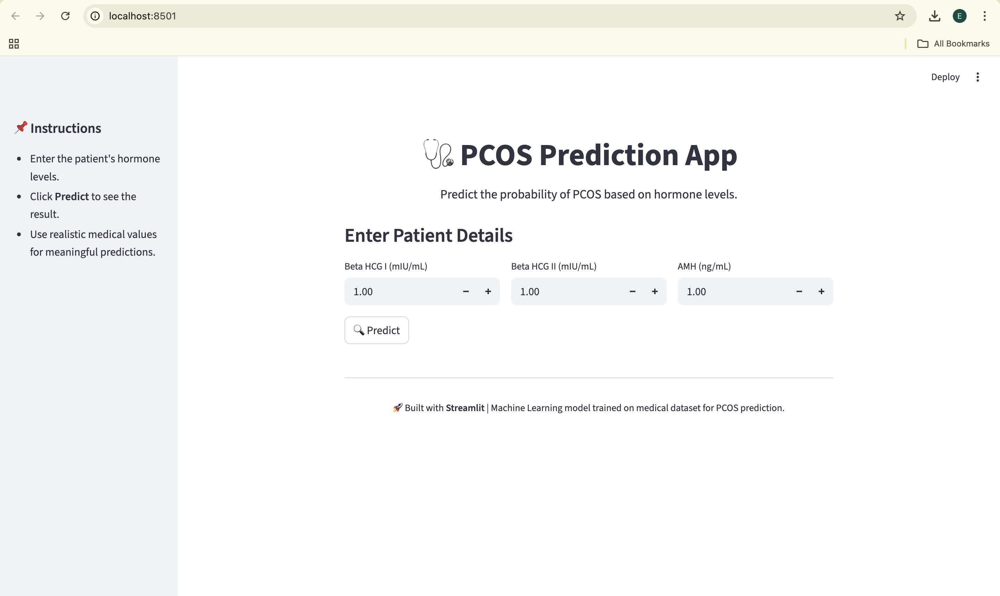
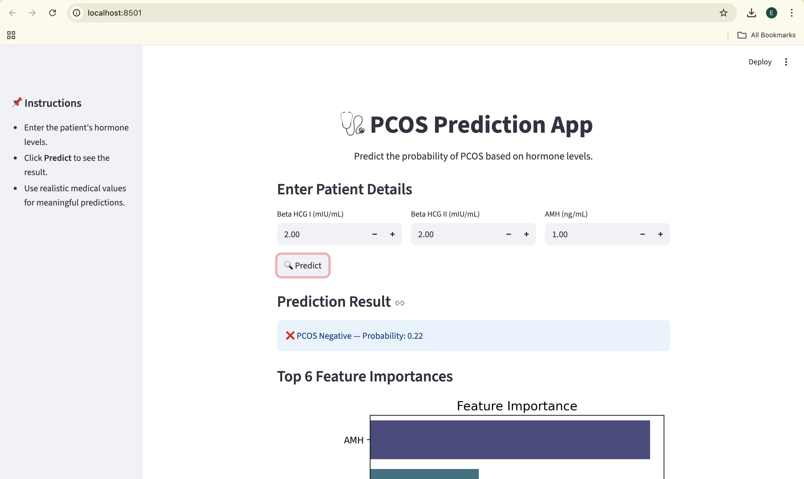
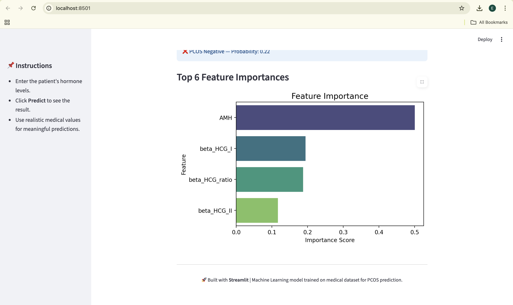

# 🩺 PCOS Prediction Project

This project predicts the likelihood of **Polycystic Ovary Syndrome (PCOS)** based on patient health records using **Machine Learning**.  
It combines **exploratory data analysis (EDA)**, **feature engineering**, and a **Streamlit web app** for interactive predictions.

---

## 📂 Project Structure
```
pcos_prediction/
├── app/
│ ├── streamlit_app.py # Streamlit app for prediction
│ ├── best_rf_model.pkl # Trained Random Forest model
│ └── scaler.pkl # Scaler used for preprocessing
├── data/
│ ├── PCOS_infertility.csv
│ └── PCOS_data_without_infertility.xlsx
├── images/ # Screenshots of the app
│ ├── home.png
│ ├── predict.png
│ └── predict2.png
├── notebooks/
│ └── PCOS_Prediction.ipynb # Jupyter Notebook with full pipeline
├── requirements.txt
└── README.md
```
---

## 🚀 Features
- **Data Preprocessing**: Missing value handling, encoding, normalization.  
- **EDA**: Visual insights into BMI, hormone levels, cycle length, etc.  
- **Modeling**: Logistic Regression, Random Forest, and XGBoost with hyperparameter tuning.  
- **Evaluation**: Accuracy, Precision, Recall, F1-score, ROC-AUC.  
- **Explainability**: Feature importance analysis.  
- **Deployment**: Streamlit app for real-time predictions.  

---

## 📈 Model Performance
- **Accuracy**: 0.89  
- **ROC-AUC**: 0.92  
- **F1-score**: 0.88  

---

## 📸 Screenshots

### 🏠 Home Page


### 🔍 Prediction Input


### 📊 Prediction Result


---

## 🖥️ How to Run the App
1. Clone this repository:
    ```bash
        git clone https://github.com/your-username/pcos_prediction.git
        cd pcos_prediction/app


2. Install dependencies:
    ```bash
        pip install -r requirements.txt

3. Run the app:
    ```bash
        streamlit run streamlit_app.py

## ✨ Future Improvements

Add more features like insulin resistance indicators.

Expand dataset for better generalization.

Deploy the app on Streamlit Cloud / Hugging Face Spaces for public access.

---

## 🔹 About

This project was created as part of a Data Science Portfolio to demonstrate skills in:

Data Cleaning & EDA

Machine Learning & Model Deployment

Interactive Dashboards with Streamlit

---

📝 Resume Highlight

Built an end-to-end ML pipeline and deployed a PCOS prediction app using
Random Forest (ROC-AUC: 0.92), demonstrating skills in data science, ML modeling, and deployment.

---

👩‍💻 Author: Esha Yadav
🔗 Connect with me on [LinkedIn](https://www.linkedin.com/in/esha-yadav-3aa126253/) | [GitHub](https://github.com/EshaYadav11)